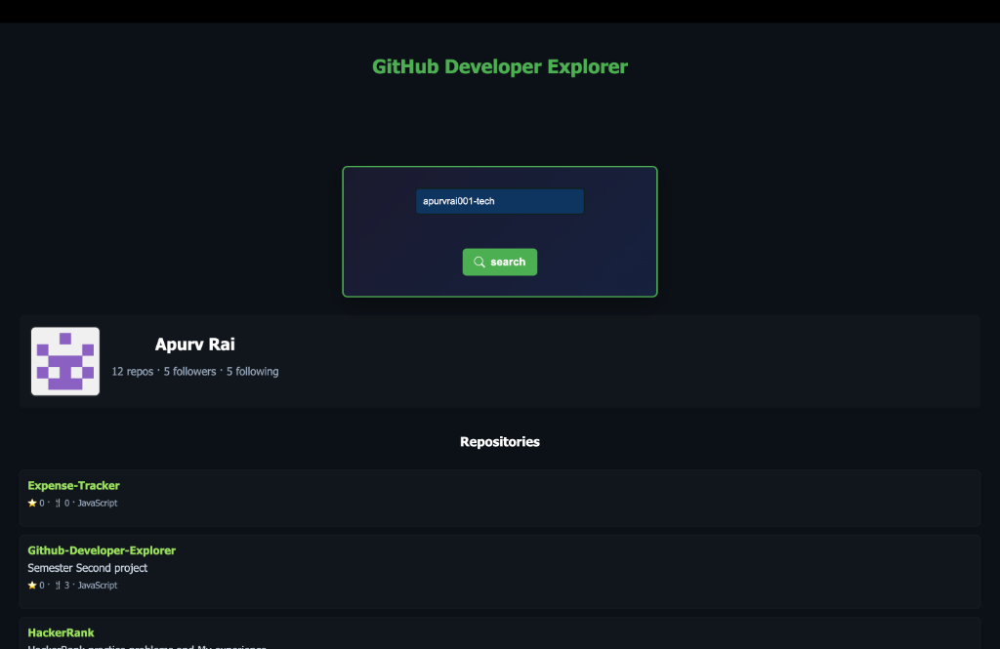
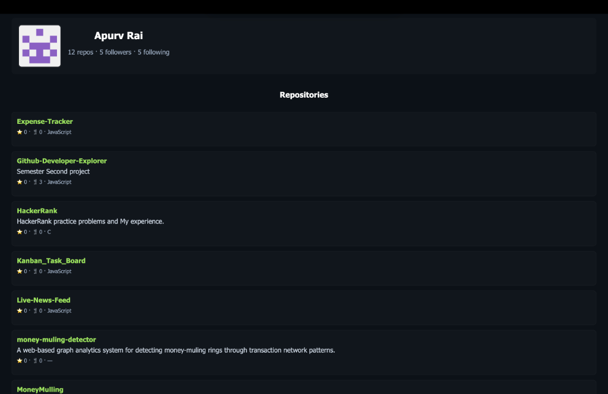
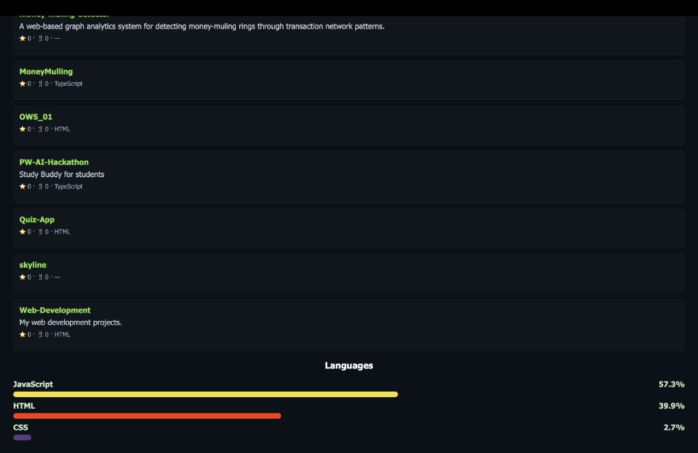

# GitHub Developer Explorer

A simple web app to search any GitHub user and view their profile, repositories, and language stats.

Built with **HTML**, **CSS**, and **vanilla JavaScript** using the [GitHub REST API](https://docs.github.com/en/rest).

## Screenshots

### Search


### Profile & Repos




### Language Breakdown


## Features

- Search any GitHub user by username
- View profile info (avatar, bio, followers, repos)
- Browse all public repositories sorted by stars
- See a language breakdown chart across repos

## How to Run

1. Clone the repo
   ```bash
   git clone https://github.com/apurvrai001-tech/Github-Developer-Explorer.git
   cd Github-Developer-Explorer
   ```

2. Open `index.html` in your browser — that's it!

   Or use a local server:
   ```bash
   python3 -m http.server 8080
   ```

## Project Structure

```
├── index.html
├── css/
│   └── style.css
├── js/
│   ├── app.js       # Main entry point
│   ├── api.js       # GitHub API calls
│   ├── ui.js        # DOM rendering
│   ├── chart.js     # Language chart
│   └── utils.js     # Helpers
└── screenshots/
```

## Contributing

Feel free to fork and submit a pull request!
